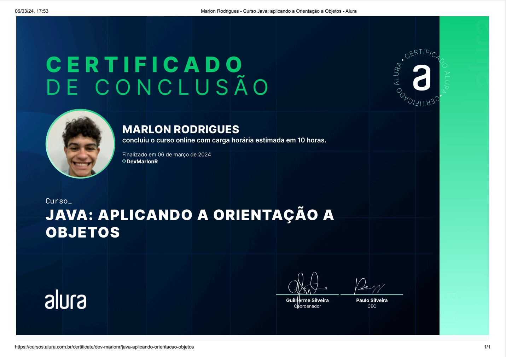

# Repositorio Java Aplicando a Programação Orientada a Objetos

<a href="https://giphy.com/gifs/design-halloween-illustration-l3vRgbI3GmUngNtF6">GIPHY</a>

Repositório destinado ao curso Java: Aplicando a Programação Orientada a Objetos, da plataforma Alura. Onde foi tratado conceitos do paradigma citado, como por exemplo:

* Objetos
* Classes
* Atributos
* Metodos

E pilares importantes como:

1. Herança
2. Polimorfismo
3. Encapsulamento
4. E até mesmo Interfaces

## Extras

Localizado na pasta "extras" está um projeto que foi pedido em sala de aula na faculdade de Análise e Desenvolvimento de Sistemas a elaboração de um algoritmo de Escalonamento de processos, resolvi colocar em prática o conteúdo aprendido no curso para criar classes para resolver o desafio passado.

### Abaixo encontra-se o certificado do Curso.

